# AN ANIMATED MAP OF INEQUALITY IN PEER-2-PEER LENDING

**Author**: Michel Kana

**Affiliation**:  IACS, FAS, Harvard Extension School

## Motivation

This project was conducted in January 2019 as contribution to the Harvard Data Science Animation Contest. We have chosen to demonstrate a datascience concept using a practical and current example.

Between 1935 and 1940, New Deal's most important agencies, the Home Owners' Loan Corporation or HOLC (pronounced "holk").
recruited mortgage lenders, developers, and real estate appraisers in nearly 250 cities to create maps that color-coded credit worthiness and risk on neighborhood and metropolitan levels. 

These maps, called **Redlining** and their accompanying documentation helped set the rules for nearly a century of real estate practice. They were digitalized and can be viewed on [MAPPING INEQUALITY](https://dsl.richmond.edu/panorama/redlining).

In this study we demonstrate the datascience concept of **Exploratory Data Analysis** by studying the spacial correlation between *Redlining* from 1935-40 and the peer-2-peer lending landscape of today.

Especially we plot data obtained from 24 millions loans from [LendingClub](http://lendingclub.com/), the largest US-based peer-to-peer lending marketplace.

Results indicates that *Redlining* is likely to still taking place today.

**Artifact**:

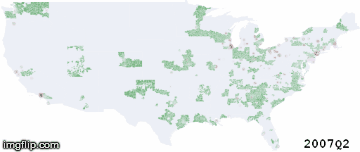

Maps with full resolution are [here](maps/maps_full_resolution).

 
**Code:** *[link to code file](michelkana_code.ipynb)*

## Explanation

This visualization helps to build a more intuitive understanding of **Exploratory Data Analysis**. This is because obtaining, cleaning and exploring data from multiple sources is a skill that students should acquire in a data science curriculum.

EDA is applied here in a practical case, for investigating if leaving in a zone that was redlined between 1935 and 1940 increases the probability of being rejected by the LendingClub as a borrower, or being assigned a high interest rate as a high risk borrower.

### Crawling the redline geodata

After studying/reverse-engineering the [MAPPING INEQUALITY](https://dsl.richmond.edu/panorama/redlining) website, we found out the queries necessary for fetching all GEO shapfiles of all *Redlining maps* back in the 1930s.
The shapefiles contain the polygones (long and lat) of US zones redlined in the past by HOLC.

The Shapefiles also describe the risk category that was assigned to the each zone:

* A - Best 
* B - Still Desirable
* C - Definitely Declining
* D - Hazardous

We used the python geopandas package to process the shapefiles.

In order to link the redlined zones with lending data, we had to do some **features engineering**. 
Using the latitude and longitude coordinates we looked-up the correspond zipcodes thanks to this great [US zipcode library](https://pypi.org/project/uszipcode/)

We then calculated the area of each redlined zone in squared kilometers. We also calculated the ratio of A, B, C, and D subzones within each zone. 

These ratios helped us estimating the **HOLC loan reject ratio** that was applied in the 1935s. The ratio was assumed to be  0% for applicants in subzone A; 100% for C and D, and 90% in subzone B. We chose 90% because it is close to the average reject ratio at LendingClub currently.

The ratios were further averaged per zipcode.

### Obtaining loan data

The loan data was downloaded from LendingClub website and cleaned up as recommended [here](https://sites.google.com/view/cs109alendingclubgroup26fall18).

We calculated new statistics such as **LendingClub loan reject ratio** (the percentage of loan requests which were rejected per zipcode), **LendingClub loan grade ratio** (the percentage of loans which received a specific interest rate per zipcode).

### Obtaining US geodata

In order to plot the redlined zones and lending statistics on a US map, we downloaded the US zipcode shapefile from US Census Data Portal.

### Merging data

Since the LendingClub discloses only 3 out of 5 digits from the applicant's zipcode, we had to summarize the data and merge based on 123xx-like zipcodes regions. 

## Results

Most zones considered by HOLC were ranked as *Hazardeous* or *Definitely Declining* in 1930s.

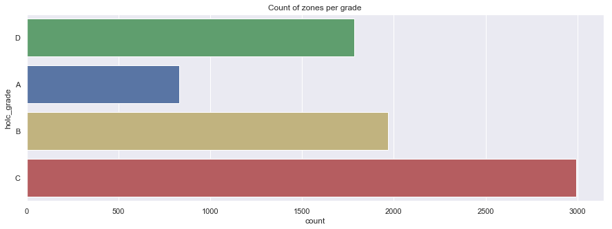

The zones redlined by HOLC were usually not very large, less than 5 km2. We noticed few outliers with surface reaching 180 km2. 

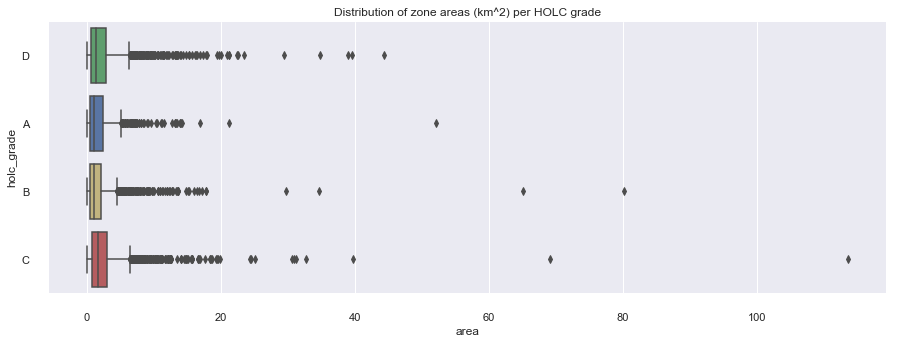

States AL (Alabama) and KS (Kansas) had the largest *Hazardous* total area, as classified by HOLC in 1930s. Zones in the states of NH (New Hampshire) and IN (Indiana) were mostly classified as *Definitely Declining*.  

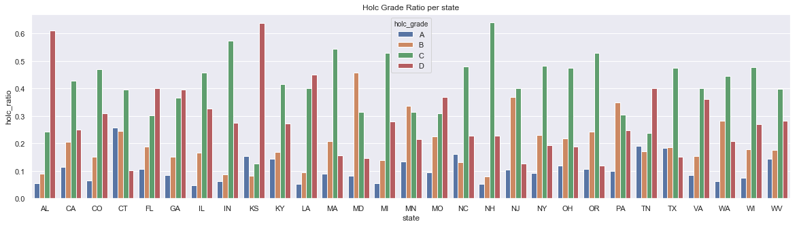

LendingClub appears to reject more loans on average than the HOLC did in 1930s.

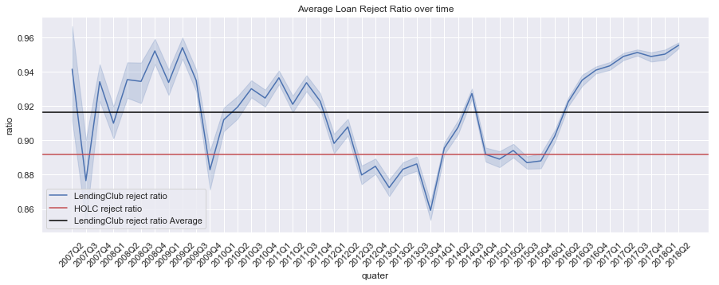

A positive correlation between the loan reject ratio of LendingClub and HOLC is visible. This suggests the following hypothesis: **zones where HOLC rejected the most or almost all loans in 1930s are the same zones where LendingClub is likely to reject a lot of loans today.**
 
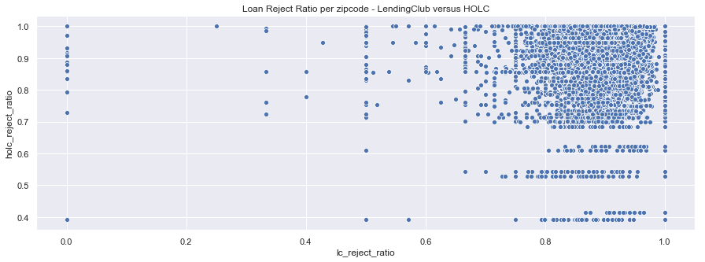

The LendingClub reject ratio distribution appears to copy HOLC distribution of redlined zones.

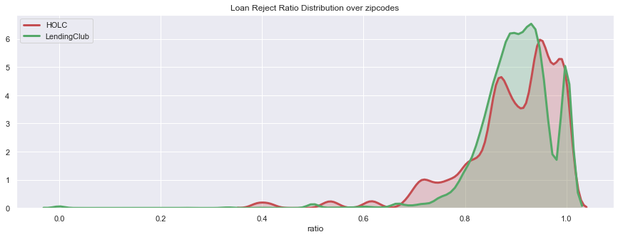

The correlation between HOLC features and LendingClub statistics is weak but existant.

**LendingClub**:

* lc_total_requested: total number of loans (application)
* lc_total_rejected: total number of loans (application) rejected
* lc_total_accepted: total number of loans (application) accepted
* LC_A_accepted, LC_A_ratio: total number and ratio of accepted loans which were assigned the interest rate A (lowest possible)
* LC_B_accepted, LC_A_ratio: total number and ratio of accepted loans which were assigned the interest rate B 
* LC_C_accepted, LC_A_ratio: total number and ratio of accepted loans which were assigned the interest rate C 
* LC_D_accepted, LC_A_ratio: total number and ratio of accepted loans which were assigned the interest rate D 
* LC_E_accepted, LC_A_ratio: total number and ratio of accepted loans which were assigned the interest rate E 
* LC_F_accepted, LC_A_ratio: total number and ratio of accepted loans which were assigned the interest rate F 
* LC_G_accepted, LC_A_ratio: total number and ratio of accepted loans which were assigned the interest rate G (highest possible)

*The LendingClub assigned interest rate using grades A, B, C, D, E, F, G [(more)](https://www.lendingclub.com/public/rates-and-fees.action)*

**HOLC**:

* zip_area: the total area of the redlined zone in squared kilometers
* A_area, A_ratio: the total area in squared kilometers and ratio of A subzones (Best)
* B_area, B_ratio: the total area in squared kilometers and ratio of B subzones (Still Desirable)
* C_area, C_ratio: the total area in squared kilometers and ratio of C subzones (Definitely Declining) 
* D_area, D_ratio: the total area in squared kilometers and ratio of D subzones (Hazardous)

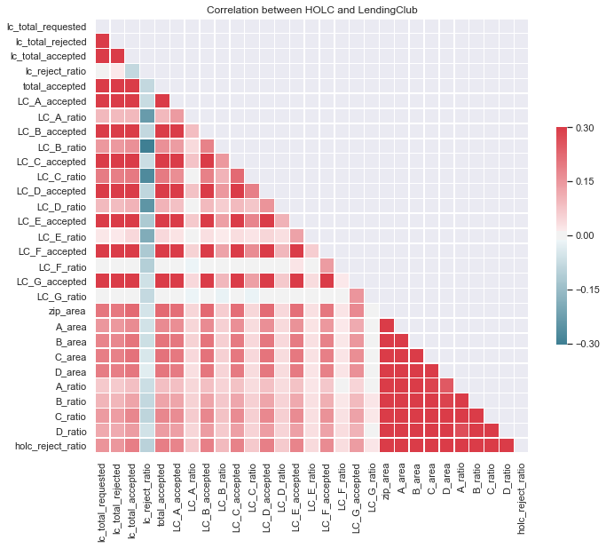

There are fewer applicants who received high interest rates (F, G) in redlined zones, suggesting that the LendingClub might not be considering redlines when accessing the risk of credit charge-off.
 
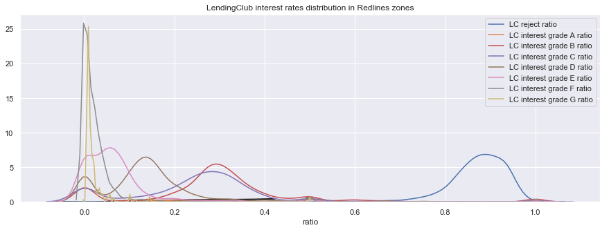

The hotspots of HOLC redlining back in 1930s can be seen below [(source)](https://dsl.richmond.edu/panorama/redlining)

We reproduced the HOLC map below.

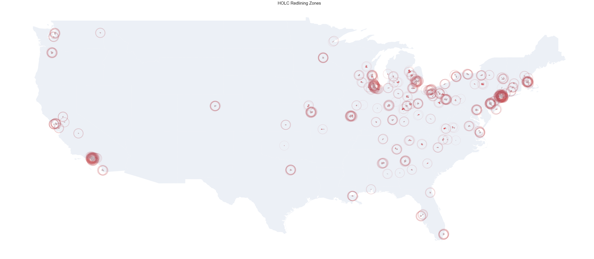

### Effect of HOLC redlining on today's LendingClub rejects and interest rate

We further generated a map for each quarter starting from the time when LendingClub started sharing loan data in 2007Q2, up to 2018Q2.

* map layer 0: US baseline states' map - **light blue shapes** showing US states,
* map layer 1: HOLC redlining map - **red circles** showing places where the most redlining happened in 1930s,
* map layer 2: LendingClub Reject Ratio - **green shapes** showing places where the LendingClub is rejecting more than 90% applicants,
* map layer 3: LendingClub Interest Rate - **magenta shapes** showing places where the LendingClub is assigning on average the highest interest rates.

The maps can be interpreted as follows:

* **green** is an indicator of very high reject ratio by LendingClub (>90%).

* **dark violet** is an indicator of strong correlation between HOLC redlining and LendingClub rejects. Violet color is obtained when the red shape (from HOLC) is overlayed by the green shape (from LendingClub).

* **dark magenta** is an indicator of strong correlation between HOLC redlining and LendingClub high interest rate.

Around 2007 we can see a correlation between zones where a high number of rejects were recorded and former HOLC redlining zones.

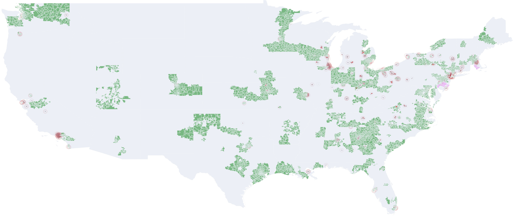

A year later, in 2008, rejects become more spread outside the HOLC zones. But HOLC zones remains those with higher interest rates.

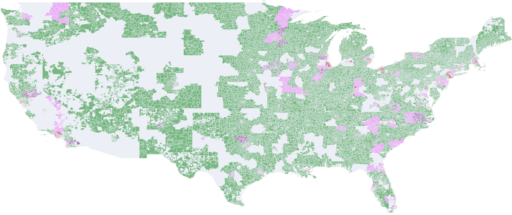

After 2012Q1 we cannot see any clear link between HOLC and LendingClub anymore. There are more rejects, but they are found in almost all states.

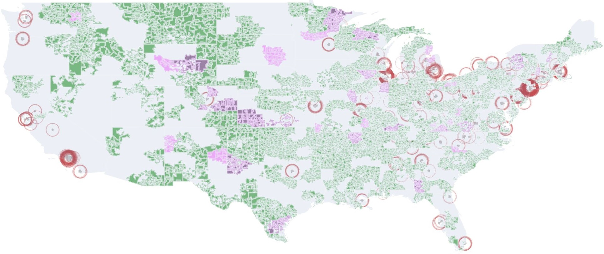

As the LendingClub is gaining more marketshare, we can see its activities equally distributed accross the US, as shown in this 2016Q3 map. 

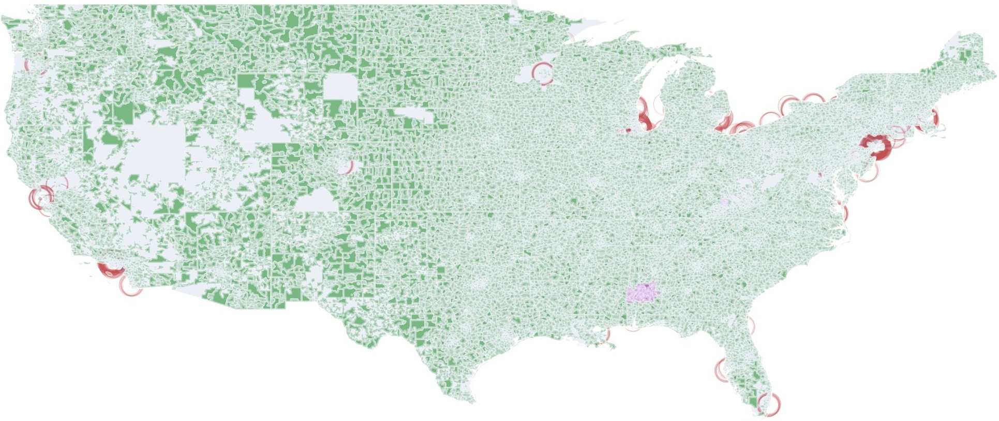

HOLC redlining seems to be forgotten and not affecting any LendingClub statistics, when looking at the 2018Q2 map. 

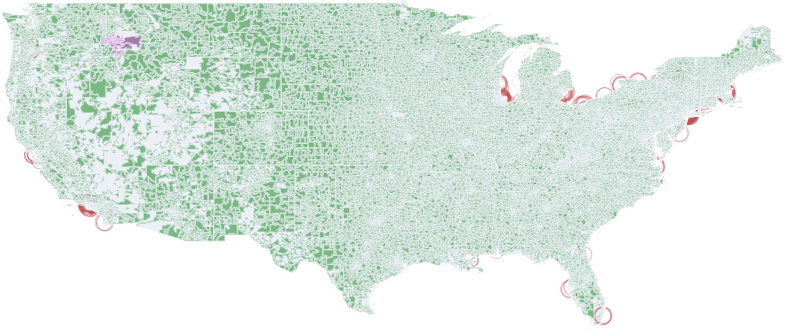

**All maps are available [here](maps/maps_full_resolution)**

## Conclusion

[Modern redlining](https://www.revealnews.org/article/for-people-of-color-banks-are-shutting-the-door-to-homeownership/) has been exposed [recently in 61 US cities](https://www.revealnews.org/blog/we-exposed-modern-day-redlining-in-61-cities-find-out-whats-happened-since/).
Another investigation identified a [couple of banks](https://www.revealnews.org/article/8-lenders-that-arent-serving-people-of-color-for-home-loans/) which appearently exclude some minorities from their clients' portforlio.
More can be found about [specific cases](https://www.revealnews.org/blog/3-investigations-opened-after-reveal-uncovers-redlining-in-philly/) at court.

Our study does not provide solid evidence of racial discrimination by the LendingClub. The hypothesis of existing correlation between 1930's redlining and today's LedingClub policies for accepting loan requests and assessing risks of default remains to be verified. 

There are however some signs of unfair algorithms or historical bias in data used at LendingClub, looking at our exploratory data analysis. Several questions arize and can be subject of deeper investigation:

* **Does the data used by the LendingClub contain some kind of bias colinear to HOLC redlining, e.g. FICO score, employment length, race.?**
* **In which extend does the zipcode affect LendingClub decisions?**
* **Which adjustments in risk assessement algorithms are necessary to take into account the HOLC redlining, which obviously does not belong to the past?**

The overall **datascience process** as taught in the Harvard FAS CS109a Introduction to Data Science course is an iterrative process where more questions are disclosed. 

We demonstrated **Exploratory Data Analysis** in this project. A choropleth map animation was built as showcase of spatial timeseries visualization. We touched additional data science concepts: algorithm fairness, web crawling, data cleaning, features engineering, correlation analysis.

## Disclaimer

Data and analysis within this project are provided without warranty. We are not responsible of any legal or ethical consideration that might derive from our analysis. 